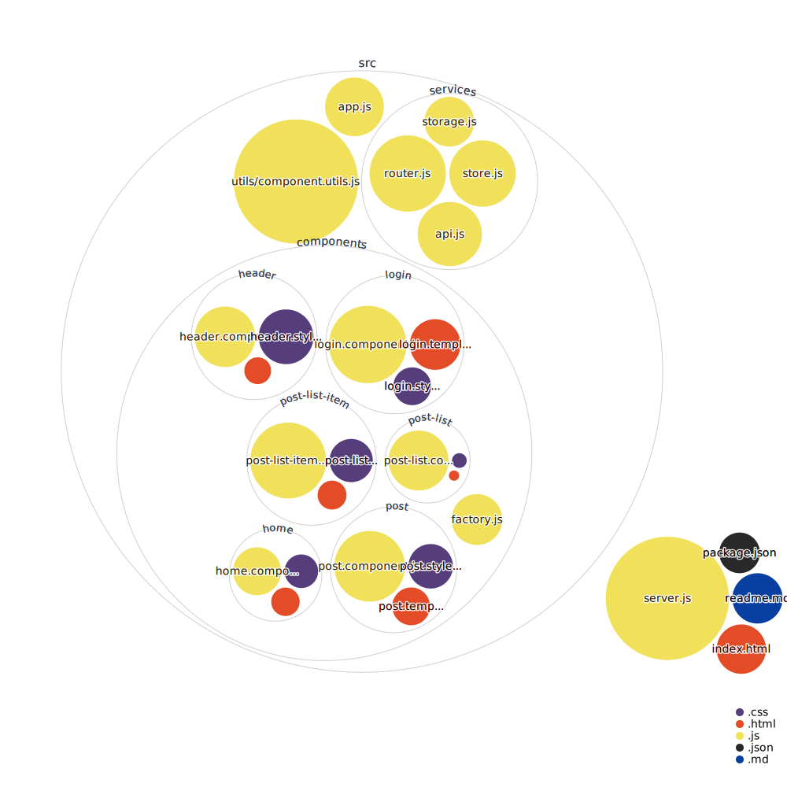

# VanillaJS SPA

This project is a simple SPA (Single Page Application) built with VanillaJS.

It is a simple application that request authentication to DummyJSON API and display blog posts from this API.



## Getting Started

### Prerequisites

- [Node.js](https://nodejs.org/en/)

### Installing

1. Clone this repository

```bash
git clone
```

2. Run the project

```bash
npm start
```

## Built With

- [VanillaJS](http://vanilla-js.com/)

## Authors

- **[Thomas SLOBODA](https://github.com/thomassloboda)**

## License

This project is licensed under the MIT License - see the [LICENSE.md](LICENSE.md) file for details
